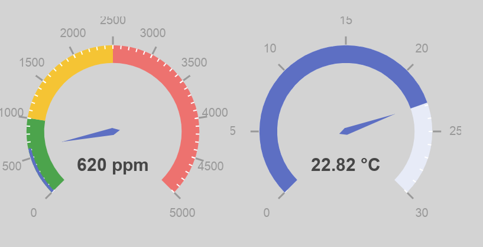

#Raspberry Pi CO2 Monitor

Uses a Pi & a [pi3g CO2 Sensor breakout](https://pi3g.com/products/rpi-co2-sens-precision-long-term-calibrated-co2-sensor/) board

See also https://github.com/pi3g/ee895-python-example

## Setup
    python3 -m venv venv
    . venv/bin/activate
    pip install -r requirements.txt
    flask run --host=0.0.0.0

## Usage
Visit [http://127.0.0.1:5000](http://127.0.0.1:5000). This will show 2 guages, 1 for CO2 levels, and one for temperature.

